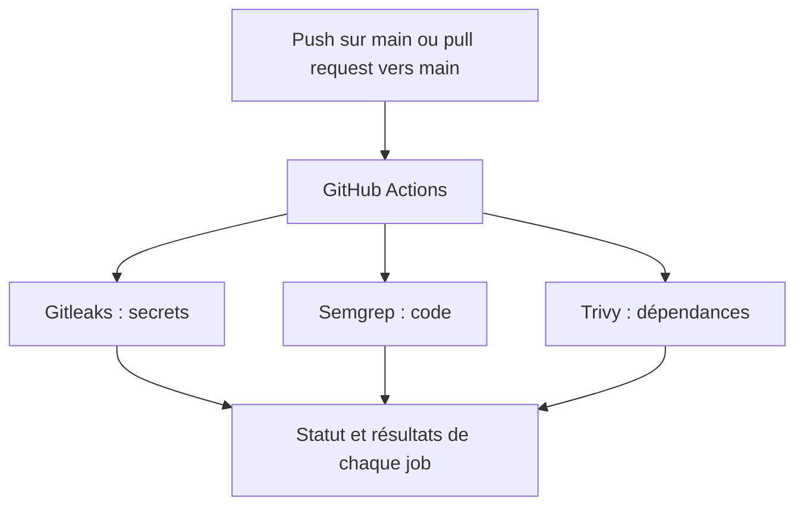

# Pipeline DevSecOps avec Gitleaks, Semgrep et Trivy

Automatisation de la détection de secrets, de l'analyse statique du code et de la recherche de vulnérabilités dans les dépendances avec GitHub Actions.

Ce projet contient une petite application Node.js avec Express, volontairement vulnérable. Elle sert de support à un laboratoire DevSecOps pour intégrer des contrôles de sécurité dès les modifications du code : c'est l'approche **shift-left**.

Le workflow lance trois contrôles indépendants lors des pushes sur `main` et des pull requests vers cette branche : Gitleaks pour les secrets, Semgrep pour le code et Trivy pour les dépendances.

> **Usage pédagogique uniquement.** La route `/exec` exécute directement une commande fournie par l'utilisateur, avec les droits du serveur. Utilisez un environnement local isolé et ne rendez pas cette application accessible publiquement.

## Problématique

Une application peut contenir plusieurs catégories de risques :

- des clés API, tokens ou mots de passe enregistrés dans le dépôt ;
- du code permettant une exécution de commandes non contrôlée ;
- des bibliothèques associées à des vulnérabilités connues.

Attendre le déploiement pour découvrir ces problèmes rend leur correction plus difficile. L'objectif du laboratoire est de rendre ces contrôles automatiques et visibles dès les contributions au projet.

## Solution apportée

Le pipeline couvre trois axes complémentaires :

| Outil | Type de contrôle | Objectif |
| --- | --- | --- |
| Gitleaks | Détection de secrets | Rechercher les informations sensibles présentes dans le code et les commits analysés. |
| Semgrep | SAST — analyse statique de sécurité | Identifier des constructions dangereuses sans démarrer l'application. |
| Trivy | SCA — analyse des composants logiciels | Rechercher des vulnérabilités connues dans les dépendances identifiées. |

Le code contient un exemple explicite d'exécution de commande non sécurisée. Les anciennes versions d'Express et de Lodash fournissent également un cas d'étude pour l'analyse des dépendances.

Le workflow actuel est consacré aux scans de sécurité. Il ne comporte pas d'étape de test applicatif, de build ou de déploiement.

## Architecture



Les trois jobs sont indépendants et peuvent s'exécuter en parallèle sur des runners `ubuntu-latest`.

## Structure du projet

```text
.
├── .github/
│   └── workflows/
│       └── evsecops-pipeline.yml
├── index.js
├── package.json
└── README.md
```

| Fichier | Rôle |
| --- | --- |
| [index.js](index.js) | Serveur Express et route de démonstration vulnérable. |
| [package.json](package.json) | Dépendances et commande de démarrage. |
| [evsecops-pipeline.yml](.github/workflows/evsecops-pipeline.yml) | Déclencheurs et configuration des trois scans. |

## Prérequis

- Node.js et npm pour démarrer l'application en local ; aucune version n'est imposée dans le dépôt.
- Un dépôt GitHub avec GitHub Actions activé pour exécuter le pipeline.
- Un accès réseau depuis les runners pour récupérer les actions, l'image Semgrep, les règles et les données de vulnérabilités.

Docker intervient dans le job Semgrep sur le runner GitHub. Il n'est pas nécessaire pour démarrer l'application en local.

## Installation de l'application

Depuis la racine du projet, installez les dépendances :

```sh
npm install
```

Cette commande génère normalement un `package-lock.json`. Ce fichier doit être ajouté au dépôt pour permettre au scan Trivy d'analyser les dépendances npm résolues, y compris les dépendances transitives.

Démarrez ensuite le serveur :

```sh
npm start
```

Le serveur utilise le port `3000`. Dans l'environnement isolé du laboratoire, ouvrez l'adresse suivante pour afficher un message de démonstration :

```text
http://localhost:3000/exec?cmd=echo%20Bonjour
```

| Route | Description |
| --- | --- |
| `GET /exec?cmd=echo%20Bonjour` | Exécute la commande `echo Bonjour` et renvoie sa sortie. |

La seule route définie est `/exec`. Aucune page d'accueil n'est prévue à `/`.

Le port est défini directement dans `index.js`. Le projet ne contient pas de configuration par fichier `.env`.

## Vulnérabilité de démonstration

Le traitement de la requête transmet le paramètre `cmd` directement au shell :

```js
const userInput = req.query.cmd;
exec(userInput, (err, stdout) => {
  if (err) return res.status(500).send(err.message);
  res.send(stdout);
});
```

Aucune authentification ni restriction de commande n'est appliquée. Une personne pouvant accéder à cette route peut donc faire exécuter des commandes sur la machine qui héberge le serveur.

Ce cas permet d'étudier la détection d'un flux entre une entrée utilisateur et une fonction d'exécution de commandes. Sa détection effective par Semgrep dépend des règles récupérées et du filtre de sévérité configuré.

## Pipeline de sécurité

Le workflow [.github/workflows/evsecops-pipeline.yml](.github/workflows/evsecops-pipeline.yml) porte le nom **DevSecOps Shift-Left Pipeline**.

Il est déclenché :

- lors d'un push sur `main` ;
- lors de l'ouverture, de la mise à jour ou de la réouverture d'une pull request visant `main`.

Il ne définit pas de déclenchement manuel avec `workflow_dispatch`.

### Gitleaks — détection de secrets

Le job `secret-scan` récupère le dépôt avec `actions/checkout@v4` et `fetch-depth: 0`, afin de rendre tout l'historique Git disponible. Il utilise ensuite `gitleaks/gitleaks-action@v2` pour rechercher les secrets dans les commits sélectionnés par l'action.

### Semgrep — analyse statique du code

Le job `sast-scan` monte le dépôt dans un conteneur Docker et exécute :

```sh
semgrep scan --config=auto --error --severity=ERROR /src
```

- `--config=auto` récupère des règles adaptées au projet.
- `--severity=ERROR` filtre les résultats sur les règles de ce niveau.
- `--error` renvoie un code de sortie non nul si des résultats sont trouvés, ce qui fait échouer le job.

Les résultats de sévérité `WARNING` et `INFO` ne sont pas retenus par cette configuration. Voir la [référence officielle Semgrep](https://docs.semgrep.dev/cli-reference).

### Trivy — analyse des dépendances

Le job `sca-scan` utilise `aquasecurity/trivy-action@master` avec les paramètres suivants :

| Paramètre | Valeur | Effet |
| --- | --- | --- |
| `scan-type` | `fs` | Analyse les fichiers du dépôt. |
| `scan-ref` | `.` | Utilise la racine du projet comme cible. |
| `severity` | `CRITICAL,HIGH` | Retient les niveaux de sévérité indiqués. |
| `exit-code` | `1` | Fait échouer le job si des résultats correspondant au filtre sont trouvés. |

**Limite actuelle :** aucun `package-lock.json` n'est fourni dans le projet. Pour npm, Trivy analyse ce fichier lors d'un scan des fichiers ; il n'analyse pas les dépendances déclarées dans le seul `package.json`. Le contrôle SCA ne couvre donc pas encore les dépendances npm attendues. Voir la [documentation Node.js de Trivy](https://www.trivy.dev/docs/latest/guide/coverage/language/nodejs/).

## Configuration GitHub

### Token et licence Gitleaks

Le workflow transmet à Gitleaks le secret `GITHUB_TOKEN`, [créé automatiquement par GitHub pour chaque job](https://docs.github.com/en/actions/concepts/security/github_token). Il n'est pas nécessaire de créer un token personnel pour cette configuration.

Pour un dépôt appartenant à une organisation, l'action Gitleaks demande également une licence `GITLEAKS_LICENSE`. Ce secret doit être ajouté dans **Settings > Secrets and variables > Actions**, puis transmis dans le bloc `env` de l'étape Gitleaks. Le workflow actuel ne le transmet pas. Voir les [conditions d'utilisation de Gitleaks Action](https://github.com/gitleaks/gitleaks-action#environment-variables).

### Contrôles obligatoires avant fusion

Pour rendre les scans obligatoires avant une fusion, configurez une règle de protection ou un ruleset sur `main` et rendez obligatoires les trois contrôles :

- `Gitleaks (Secrets Detection)` ;
- `Semgrep (SAST)` ;
- `Trivy (SCA Dependency Scan)`.

Cette règle se configure dans les paramètres GitHub du dépôt. Elle n'est pas définie par le fichier du workflow.

## Résultats attendus

Après un événement déclencheur, ouvrez **Actions > DevSecOps Shift-Left Pipeline**, puis consultez le statut et les logs de chaque job.

| Contrôle | Résultat à observer |
| --- | --- |
| Gitleaks | Les éventuels secrets détectés dans les commits analysés. |
| Semgrep | Les résultats de niveau `ERROR`, notamment ceux liés à l'exécution de commandes si les règles sélectionnées couvrent ce cas. |
| Trivy | Les vulnérabilités `HIGH` ou `CRITICAL` des dépendances identifiées, après ajout du lockfile au dépôt. |

Un résultat sans détection doit être interprété selon les fichiers réellement analysés et les seuils configurés. Le README décrit le fonctionnement et les résultats attendus ; il ne contient pas de rapport attestant l'exécution des scans.

## Limites et améliorations possibles

- **Couverture SCA :** générer et versionner `package-lock.json` pour rendre les dépendances npm analysables par Trivy et figer leurs versions résolues.
- **Compatibilité des actions :** le workflow utilise `gitleaks-action@v2` et `checkout@v4`. Les mainteneurs de Gitleaks indiquent la fin de prise en charge du runtime Node.js 20 sur les runners GitHub et recommandent une migration vers `gitleaks-action@v3` et `checkout@v6`. Voir leur [guide de migration](https://github.com/gitleaks/gitleaks-action#migrating-from-v2-to-v3).
- **Reproductibilité :** l'action Trivy suit `master` et l'image Semgrep n'a pas de tag explicite. Fixer des versions ou des références immuables permettrait de mieux maîtriser les changements d'outils.
- **Tests applicatifs :** aucun script `npm test` n'est défini. Des tests et leur intégration au pipeline peuvent compléter les contrôles de sécurité.

## Arrêt de l'application

Dans le terminal qui exécute `npm start`, utilisez `Ctrl+C` pour arrêter le serveur.

## Technologies utilisées

| Technologie | Version ou référence présente | Rôle |
| --- | --- | --- |
| Node.js | Non précisée | Exécution de l'application. |
| Express | `4.16.0` | Serveur HTTP et routage. |
| Lodash | `4.17.15` | Dépendance déclarée, non utilisée dans `index.js`. |
| GitHub Actions | Workflow YAML | Automatisation des contrôles. |
| Gitleaks Action | `v2` | Détection de secrets. |
| Semgrep | Image `returntocorp/semgrep`, sans tag explicite | Analyse statique du code. |
| Trivy Action | `master` | Analyse des dépendances. |
| Docker | Sur le runner Semgrep | Exécution du conteneur d'analyse. |

## Licence

Aucun fichier `LICENSE` ni champ `license` dans `package.json` n'est présent dans le projet. La licence du projet reste à définir.
